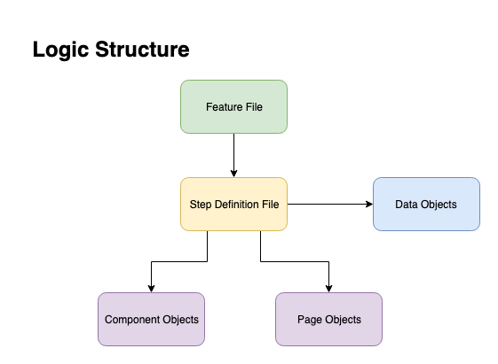

# Framework structure

Framework should utilize Page Object Model pattern with extension of Component Object approach for better flexibility. Complexity within code structure should be pushed down with compliance to [Push how down principle](https://markoh.co.uk/posts/cucumber-best-practices-push-how-down) 

**Each layer may interact only to one below it**
- Feature Files can interact with step definitions
- Data Objects can be used only on level on step definitions
- Step definitions can interact with Page/Component Objects

 [<- Go Back](../Readme.md)