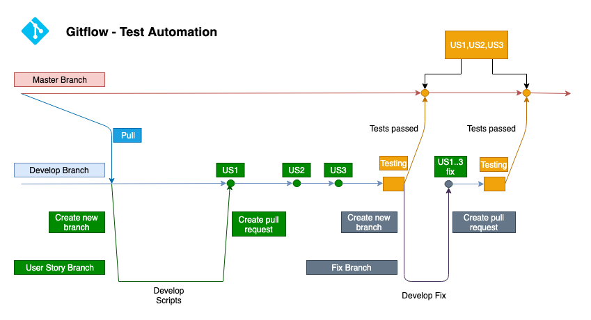
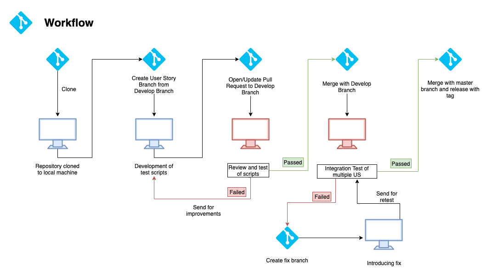
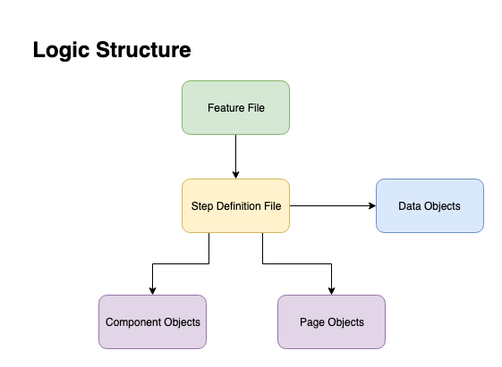

# Test Automation Development Guidelines

This document was created in order to unify test automation development on [PROJECT] project.

## Gitflow



**Branches:** 
- **Master Branch** - Main branch of the repository, only User Stories automation that has been validated and tested can reside within it.
- **Develop Branch** - Transitory branch of the repository, place for User Stories that were scripted but not tested in integration. 
- **User Story Branch** - Working branch, for each User Story new branch should be created with complaince to naming convention as below: 

``` US_[Number] [Jira ticket ID] ex. US_1 ECOMM_1234 ```
- **Fix Branch** - *Ad hoc* branch created in case of failed integration testing of batch of user stories. For each fix new branch should be created with compliance to naming convention as below:

```US_[Numbers] int fix ex. US_1,2,3,4 int fix```

**Workflow**



**Legend:**
- **Review and Test of scripts** - Code created during automation of user story is reviewed both by static code review, and by dynamic review during execution of scenarios agains the environment.
- **Integration Tests off multiple US** - All Test Cases developed  are executed at once in functional groups (iteration/suites) in order to check potential conflicts 

**Steps:**
1. Test Team designates user stories for automation, distrtibutes it within team.
2. Test Developer clones repository to local machine or pulls newest code.
3. Test Developer creates User Story branch from Develop Branch 
4. Test Developer develops automated test cases for given user story
5. Test Developer opens pull request to develop branch
6. Test Team Lead or designated Test Developer performs code review and executes created test cases agains environment
7. If Code Review and Test is passed successfully, pull request is accepted and codebase is merged to develop branch. If Code Review or Test fails, Test Developer introduces neccesary changes and step 6 is repeated.
8. After gathering all user stories from designated batch (see pt 1) Test Team Lead or designated Test Developer performs integration testing by executing all automated test cases against environment. 
9. If Integration Test passes, codebase is merged with Master branch with appropriate tag. If Integration Test fails, Test Team Lead or designated Test Developer creates fix branch and introduces neccesary changes, and step 8 is repeated.


**Rules** 
- Direct pushing to master branch is **forbidden**. Master branch can only be updated by merging with develop branch
- Direct pushing to develop branch is **unadvisable**. On edge cases such as typo fix during steps 7 or 9 pushing is allowed after consulting with Test Team Lead

## Framework structure

Framework should utilise Page Object Model pattern with extension of Component Object approach for better flexibility. Complexity within code strtucture should be pushed down with compliance to [Push how down principle](https://markoh.co.uk/posts/cucumber-best-practices-push-how-down) 



**Each layer may interact only to one below it**
- Feature Files can interact with step definitions
- Data Objects can be used only on level on step definitions
- Step definitions can interact with Page/Component Objects

## Coding standards

### Variables
- Variable names need to be meaningfull and descriptive  
  
```
String successMessage; - GOOD
String sm; - BAD

ProductListPage productListPage; - GOOD
ProductListPage plp; - BAD
```
- All names need to be written in camelCase style

From [Google Java Style Guide](https://google.github.io/styleguide/javaguide.html#s5.3-camel-case) 

Beginning with the prose form of the name:

- Convert the phrase to plain ASCII and remove any apostrophes. For example, "Müller's algorithm" might become "Muellers algorithm".
- Divide this result into words, splitting on spaces and any remaining punctuation (typically hyphens).
    Recommended: if any word already has a conventional camel-case appearance in common usage, split this into its constituent parts (e.g., "AdWords" becomes "ad words"). Note that a word such as "iOS" is not really in camel case per se; it defies any convention, so this recommendation does not apply.
- Now lowercase everything (including acronyms), then uppercase only the first character of:
... each word, to yield upper camel case, or
... each word except the first, to yield lower camel case
- Finally, join all the words into a single identifier.

 Examples:

 - "my account page" -> myAccountPage  
 - "wait for loader" -> waitForLoader

### Page/Component Objects

- Whenever element of the page is seen on multiple pages, consider making it an component object, ie - upperbar/footer 
- When naming new page/component object finish start it with its type, ie - ComponentUpperbar or PageMyAccount
- Keep Component Objects and Page Objects in separate directories
- Keep following scheme of the Page Object or Component Object

```java
/**  package statement */
package pageobjects;
/** importing java-related packages */
import java.util.list;
/** importing test related packages */
import org.openqa.selenium.By;
/** importing frameworks proprietary packages */
import x.y.z.utilities.selenium.pageobjects.BasePO;
import x.y.z.utilities.selenium.pageobjects.Element;
import x.y.z.utilities.common.Reporter;


public class ComponentMinicart extends BasePo {
    /** locators */
	private By cartTitle = By.xpath("//*[contains(@class,'title cc_title')]");
    private By nextButton = By.css('button[name="continue"]')
    private By commentField = By.css('input[name="orderComments"]')

    /** if function is more complex than jsut returning the text, add comment with following scheme:
        Scope: [Concise information about what function does]
        Accepts: [What function accepts as param]
        Returns: [What is returned]
      */
    public String getCartTitle(){
        // Log 
        Reporter.addStepLog("Getting Cart Title");
        // Element
        WebElement cartTitleElement = findElement(cartTitle,5);
        // Action 
        return cartTitle.getText()
    }

    public void fillCommentField(String comment){
        // Log
        Reporter.addStepLog("Filling order comment field with "+comment);
        // Element
        WebElement commentFieldElement = findElement(commentField,5);
        // Action
        commentFieldElement.sendKeys(comment);
    }


    public void clickNextButton(){
        // Log
        Reporter.addStepLog("Clicking on 'next' button");
        // Element
        WebElement nextButtonElement = findElement(nextButton,5);
        // Action
        nextButtonElement.click();
    }
}
```

- Each function should comply with structure as shown above, keep comments as in example.  
  
General rules for Page/Component Objects:
- Parametrise as much as possible within reason, hardcoding information is not advisable.
- If selector relies on some data that could change, consider creating a function that will return desired object  
example:
```java
// Unadvisable
private By profileName = By.xpath("//button[@id='userDropdown']//span//span[@class='invitation'][contains(text(),'Magda')]");

// Better put it within function

public By getProfileNameByElement(String profileName){
    // Log
    Reporter.addStepLog("Constructing 'By' element for profile name");
    // Element
    String locator = "//button[@id='userDropdown']//span//span[@class='invitation'][contains(text(),'" + profileName + "')]";
    // Action
    return By.xpath(locator);
}
```
- Each Page/Component object needs to be completely separate from other Page/Component objects.
- Keep functions as granular as possible within reason, keep Single Responsibility Principle in mind. One function should do exactly one thing. Functions can be grouped in one in accordance to business logic if needed, ie 


```java
public void passCredentialsAndLogin(String username, String password){
    // Log
    Reporter.addStepLog("Passing credentials and clicking 'login'");
    // Action
    this.fillUsername(username);
    this.fillPassword(password);
    this.clickLoginButton();
}  
```

### Step Definition Files

Step definition file is meeting point of scenario and all logic implemented within component/page objects. Within this level we are calling the actions defined within lower levels of logic structure. 
  
General rules:
- It is firmly advised to not hardcode any data within this level, utilise data objects instead.
- Within push how down narrative, data is passed to page/component objects functions. 
- Assertions are to be made within step definition level, gather data by functions from page/component objects and compare them using [testNG Assert](https://static.javadoc.io/org.testng/testng/6.8.17/org/testng/Assert.html) library 
```java
@Then("^I will see success message about address update")
	public void iWillSeeSuccessMessageAboutAddressUpdate() throws InterruptedException  {
		// Get expected value - TBD
        String expectedMessage = dataParser
        // Get actual value
        String actualMessage = accountDashboard.getSuccessMessage();
        // Assert values
        Assert.assertEquals(actualMessage,expectedMessage);
	}
```
- Data are to be obtained from data objects using DataParser tool (*TBD*)
- 


