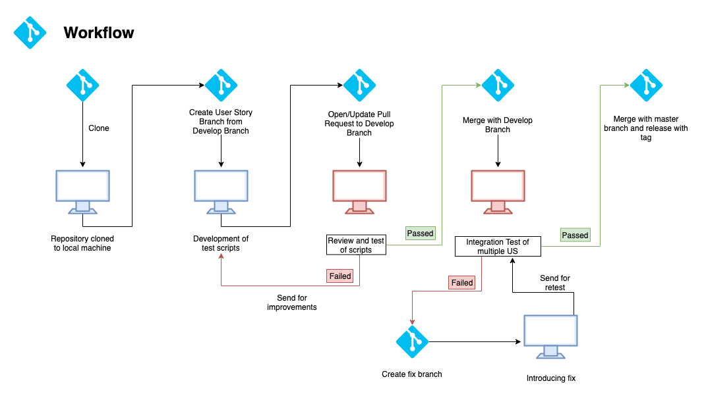

# Workflow

**Legend:**

* **Review and Test of scripts** - Code created during automation of user story is reviewed both by static code review, and by dynamic review during execution of scenarios against the environment.
* **Integration Tests of multiple US** - All Test Cases developed are executed at once in functional groups \(iteration/suites\) in order to check potential conflicts 

**Steps:** 
1. Test Team designates user stories for automation, distributes it within team. 
2. Test Developer clones repository to local machine or pulls newest code. 
3. Test Developer creates User Story branch from Develop Branch 
4. Test Developer develops automated test cases for given user story 
5. Test Developer opens pull request to develop branch 6. Test Team Lead or designated Test Developer performs code review and executes created test cases against environment 7. If Code Review and Test is passed successfully, pull request is accepted and codebase is merged to develop branch. If Code Review or Test fails, Test Developer introduces necessary changes and step 6 is repeated. 
8. After gathering all user stories from designated batch \(see pt 1\) Test Team Lead or designated Test Developer performs integration testing by executing all automated test cases against environment. 
9. If Integration Test passes, codebase is merged with Master branch with appropriate tag. If Integration Test fails, Test Team Lead or designated Test Developer creates fix branch and introduces necessary changes, and step 8 is repeated.

**Rules**

* Direct pushing to master branch is **forbidden**. Master branch can only be updated by merging with develop branch
* Direct pushing to develop branch is **inadvisable**. On edge cases such as typo fix during steps 7 or 9 pushing is allowed after consulting with Test Team Lead

